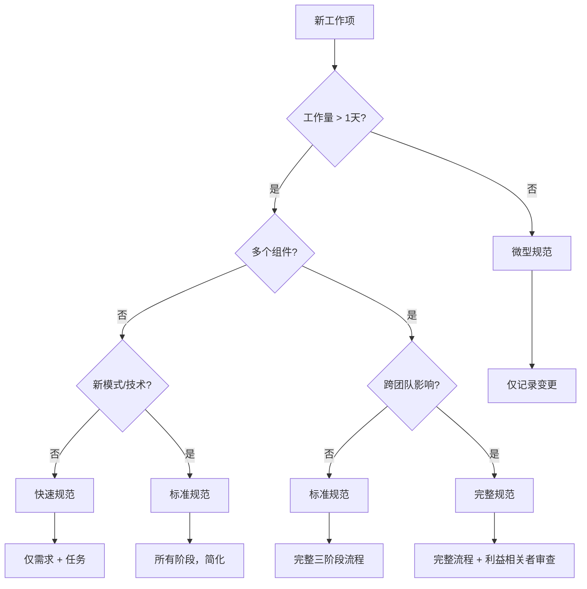

# 轻量级规范

<!-- 导航元数据 -->
<!-- 部分：方法论 | 等级：实践 | 前提条件：when-to-use.md -->
<!-- 相关：templates/quick-spec-template.md, examples/lightweight-examples.md -->

**📍 您在这里：** [主指南](../../README.md) → [方法论](README.md) → **轻量级规范**

## 快速导航
- **前提条件：** [何时使用规范](when-to-use.md)
- **模板：** [快速规范模板](../templates/quick-spec-template.md)
- **示例：** [轻量级示例](../examples/lightweight-examples.md)

---

针对小功能、错误修复和快速迭代的精简规范流程。

## 概述

不是每个变更都需要完整的三阶段规范。本指南帮助你基于复杂度、风险和影响选择合适的规范级别。

## 规范复杂度决策树



## 规范类型

### 1. 微型规范（< 1天工作量）
**适用于：**
- 错误修复
- 文案更改
- 配置更新
- 小的UI调整

**格式：**
```markdown
# [简要描述]

**内容：** 一句话描述变更
**原因：** 简要说明理由
**方法：** 2-3个实现步骤要点
**验收：** 简单的通过/失败标准
```

**示例：**
```markdown
# 修复登录按钮颜色

**内容：** 将登录按钮从蓝色改为绿色以匹配品牌指导原则
**原因：** 设计团队的品牌一致性要求
**方法：**
- 更新CSS变量 `--primary-button-color` 为 `#28a745`
- 验证颜色符合可访问性对比度要求
**验收：** 登录按钮显示绿色并通过WCAG AA对比度测试
```

### 2. 快速规范（1-3天工作量）
**适用于：**
- 小功能
- API端点添加
- 数据库架构变更
- 组件修改

**格式：**
- **需求：** 2-3个简化格式的用户故事
- **任务：** 直接的实现步骤（跳过设计阶段）
- **验收：** 明确的成功标准

**模板：**
```markdown
# [功能名称] - 快速规范

## 需求
**作为** [用户类型]
**我想要** [能力]
**这样** [好处]

**验收标准：**
- [ ] [具体的、可测试的标准]
- [ ] [另一个标准]

## 实现任务
1. [具体的编码任务及预估时间]
2. [另一个任务]
3. [测试/验证任务]

## 完成定义
- [ ] 代码完成并经过审查
- [ ] 测试通过
- [ ] 验收标准已验证
```

### 3. 标准规范（3-10天工作量）
**适用于：**
- 中等功能
- 新集成
- 性能改进
- 安全增强

**格式：**
- **需求：** 完整的EARS格式但故事较少
- **设计：** 简化的架构概述
- **任务：** 详细的实现计划

### 4. 完整规范（> 10天工作量）
**适用于：**
- 主要功能
- 系统重新设计
- 跨团队倡议
- 高风险变更

**格式：** 如主指南中描述的完整三阶段流程

## 轻量级需求格式

### 简化用户故事
代替完整的EARS格式，使用：
```markdown
**故事：** 作为[用户]，我想要[目标]，这样[好处]
**给定** [上下文]
**当** [动作]
**那么** [结果]
```

### 验收标准快捷方式
- **正常路径：** 正常情况下应该如何工作
- **边界情况：** 1-2个最可能的边界情况
- **错误处理：** 如何处理失败

### 非功能性需求
快速检查清单格式：
- [ ] 性能：[具体要求]
- [ ] 安全性：[具体要求]
- [ ] 可访问性：[具体要求]
- [ ] 浏览器支持：[具体要求]

## 快速设计模式

### 组件变更
```markdown
## 设计概述
**现有：** [当前组件行为]
**变更：** [将有什么不同]
**依赖：** [这会影响什么]
**风险：** [潜在问题]
```

### API变更
```markdown
## API设计
**端点：** [方法和路径]
**输入：** [请求格式]
**输出：** [响应格式]
**错误：** [错误响应]
```

### 数据库变更
```markdown
## 数据变更
**表：** [受影响的表]
**字段：** [新增/修改的字段]
**迁移：** [如何迁移现有数据]
**回滚：** [如何撤销（如需要）]
```

## 任务分解快捷方式

### 标准任务类别
1. **设置：** 环境、依赖、配置
2. **核心逻辑：** 主要实现工作
3. **集成：** 与现有系统连接
4. **测试：** 单元测试、集成测试
5. **文档：** 代码注释、README更新
6. **部署：** 发布准备

### 时间估算指导原则
- **简单CRUD：** 每个端点2-4小时
- **UI组件：** 每个组件4-8小时
- **集成：** 每个外部服务1-2天
- **测试：** 开发时间的25-50%
- **文档：** 开发时间的10-20%

## 轻量级规范的质量门控

### 微型规范门控
- [ ] 变更描述清楚
- [ ] 实现方法明显
- [ ] 成功标准已定义

### 快速规范门控
- [ ] 用户价值已阐述
- [ ] 技术方法合理
- [ ] 工作量估算合理
- [ ] 依赖已识别

### 标准规范门控
- [ ] 需求可测试
- [ ] 设计满足所有需求
- [ ] 任务可操作且已估算
- [ ] 风险已识别并缓解

## 常见轻量级模式

### 错误修复模式
```markdown
# 错误：[简要描述]

**问题：** [什么坏了]
**根本原因：** [为什么坏了]
**修复：** [如何修复]
**测试：** [如何验证修复]
**风险：** [可能出什么问题]
```

### 功能开关模式
```markdown
# 功能：[名称]（开关控制）

**开关：** `feature_[name]_enabled`
**默认：** `false`
**推出：** 渐进式，从内部用户开始

**实现：**
- [ ] 添加功能开关
- [ ] 在开关后实现功能
- [ ] 添加监控/指标
- [ ] 规划推出策略
```

### 配置变更模式
```markdown
# 配置：[描述]

**环境：** [哪些环境]
**值：** [什么变更]
**影响：** [这会影响什么]
**回滚：** [如何撤销]
**验证：** [如何验证成功]
```

## 何时升级规范复杂度

### 微型规范的危险信号
- 实现时间比预期长
- 需要更改多个文件
- 其他开发人员询问澄清问题
- 测试揭示了未考虑的边界情况

### 快速规范的危险信号
- 实现期间出现设计问题
- 发现对其他团队的依赖
- 性能影响变得明显
- 需要安全审查

### 升级流程
1. **暂停实现：** 复杂度增加时停止编码
2. **评估差距：** 需要什么额外规范？
3. **升级规范：** 添加缺失的需求、设计或任务
4. **获得批准：** 与利益相关者审查升级的规范
5. **恢复实现：** 用更好的规范继续

## 工具和模板

### 数字模板
- **微型规范：** 单个markdown部分
- **快速规范：** GitHub问题模板
- **标准规范：** 简化的三阶段模板

### 集成点
- **问题跟踪：** 将规范链接到工单
- **代码审查：** 在PR描述中引用规范
- **文档：** 从规范元数据自动生成

---

## 🔗 相关内容

### 前提条件
- [何时使用规范](when-to-use.md) - 规范的决策框架

### 模板
- [快速规范模板](../templates/quick-spec-template.md)
- [微型规范模板](../templates/micro-spec-template.md)

### 示例
- [轻量级规范示例](../examples/lightweight-examples.md)
- [规范升级示例](../examples/spec-upgrade-examples.md)

[← 返回方法论](README.md) | [流程指南 →](../process/README.md)
