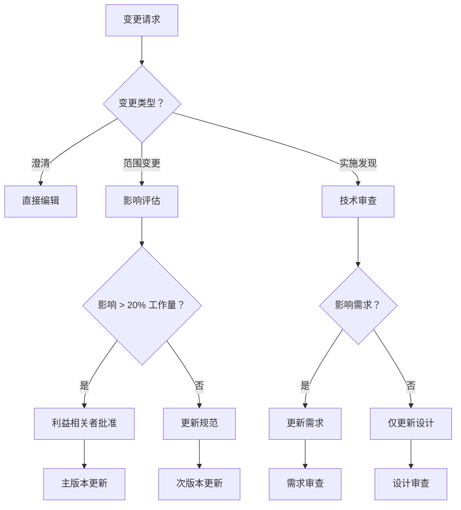

# 变更管理

<!-- 导航元数据 -->
<!-- 部分：流程 | 等级：高级 | 前提条件：requirements-phase.md, design-phase.md -->
<!-- 相关：execution/implementation-guide.md, templates/checklists.md -->

**📍 您在这里：** [主指南](../../README.md) → [流程指南](README.md) → **变更管理**

## 快速导航
- **前提条件：** [需求阶段](requirements-phase.md)、[设计阶段](design-phase.md)
- **模板：** [变更请求模板](../templates/change-request-template.md)
- **示例：** [变更管理示例](../examples/change-management-examples.md)

---

管理规范演进和处理实施期间发现的需求。

## 概述

规范是随着理解加深而演进的活文档。本指南涵盖在保持可追溯性和质量的同时管理变更的策略。

## 变更类型

### 1. 澄清性变更
- **定义：** 不影响范围的轻微澄清
- **示例：** 错字修复、格式改进、更清晰的措辞
- **流程：** 直接编辑并在提交消息中注明澄清内容

### 2. 范围变更
- **定义：** 新需求或修改现有需求
- **示例：** 额外的用户故事、改变的业务规则
- **流程：** 需要完整的变更影响评估

### 3. 实施发现
- **定义：** 编码期间发现的技术约束
- **示例：** API限制、性能瓶颈、安全要求
- **流程：** 更新设计阶段，可能需要更新需求

## 变更决策框架



## 版本控制策略

### 规范的语义化版本控制
- **主版本 (1.0.0 → 2.0.0)：** 需求或核心设计的破坏性变更
- **次版本 (1.0.0 → 1.1.0)：** 新需求或重大设计变更
- **补丁版本 (1.0.0 → 1.0.1)：** 澄清、错误修复、轻微更新

### 分支策略
```
main/
├── spec-v1.0/          # 稳定规范版本
├── feature/new-req     # 新需求分支
└── fix/clarification   # 轻微修复分支
```

## 变更影响评估

### 需要考虑的问题
1. **需求影响**
   - 这个变更是否改变现有用户故事？
   - 是否需要新的验收标准？
   - 是否有任何需求变得过时？

2. **设计影响**
   - 哪些组件受到影响？
   - 是否引入新的依赖关系？
   - 架构是否需要修订？

3. **实施影响**
   - 有多少任务需要更新？
   - 预估的工作量变化是什么？
   - 是否有新的风险或阻碍？

### 影响评分
- **低 (1-2分)：** 澄清、轻微添加
- **中 (3-5分)：** 新功能、适度设计变更
- **高 (6-8分)：** 主要范围变更、架构修订
- **严重 (9-10分)：** 基本需求变更

## 变更工作流程

### 1. 变更请求创建
```markdown
## 变更请求：[简要描述]

**类型：** [澄清/范围/实施发现]
**请求者：** [姓名/角色]
**日期：** [YYYY-MM-DD]

### 当前状态
[现在存在什么]

### 建议变更
[应该改变什么]

### 理由
[为什么需要这个变更]

### 影响评估
- 需求：[无/轻微/重大]
- 设计：[无/轻微/重大]
- 实施：[无/轻微/重大]
- 工作量变化：[+/- X 小时/天]

### 需要批准
- [ ] 产品负责人（范围变更）
- [ ] 技术负责人（设计变更）
- [ ] 利益相关者（重大变更）
```

### 2. 审查流程
1. **技术审查：** 评估实施可行性
2. **业务审查：** 验证业务价值和优先级
3. **影响分析：** 计算工作量和时间线变化
4. **批准决定：** 基于影响和价值做出执行/不执行决定

### 3. 实施
1. **更新规范：** 修改受影响的部分
2. **版本升级：** 根据变更类型更新版本
3. **可追溯性：** 将变更链接到原始需求
4. **沟通：** 通知利益相关者变更情况

## 处理实施发现

### 常见发现类型
1. **技术约束**
   - 第三方API限制
   - 性能要求
   - 安全考虑

2. **集成挑战**
   - 数据格式不匹配
   - 身份验证复杂性
   - 时序依赖

3. **用户体验问题**
   - 可访问性要求
   - 移动响应性
   - 浏览器兼容性

### 发现响应流程
1. **记录发现：** 记录发现的内容以及为什么重要
2. **评估选项：** 列出可能的解决方案和权衡
3. **更新规范：** 根据需要修改设计或需求
4. **验证变更：** 确保变更与原始目标保持一致

## 活规范实践

### 定期审查周期
- **每周：** 检查实施发现
- **冲刺结束：** 对照规范审查完成的任务
- **每月：** 评估整体规范健康状况和准确性

### 规范健康指标
- **准确性：** 与实施匹配的需求百分比
- **完整性：** 规范涵盖的实施百分比
- **时效性：** 距离上次有意义更新的天数
- **可追溯性：** 链接到规范项目的代码变更百分比

### 维护指南
1. **保持最新：** 随着实施进展更新规范
2. **维护可追溯性：** 将所有变更链接回需求
3. **记录决策：** 记录做出变更的原因
4. **沟通变更：** 让利益相关者了解情况

## 变更沟通

### 利益相关者通知
```markdown
## 规范变更通知

**规范：** [规范名称 v1.2.0]
**变更类型：** [次要/主要]
**日期：** [YYYY-MM-DD]

### 摘要
[变更的简要描述]

### 影响
- 时间线：[无变化/+X天]
- 范围：[无变化/添加/删除功能]
- 资源：[无变化/+X小时]

### 需要的行动
- [ ] 审查更新的需求
- [ ] 批准设计变更
- [ ] 更新项目时间线

### 问题/担忧
联系人：[姓名] [邮箱]
```

## 工具和集成

### 版本控制集成
- 为规范版本使用Git标签
- 将提交链接到变更请求
- 在规范仓库中维护变更日志

### 项目管理集成
- 基于变更更新任务估算
- 为变更驱动的工作创建新票据
- 将变更链接到原始用户故事

### 文档集成
- 自动生成变更日志
- 更新API文档
- 与项目wiki同步

---

## 🔗 相关内容

### 前提条件
- [需求阶段](requirements-phase.md) - 变更管理的基础
- [设计阶段](design-phase.md) - 理解设计演进

### 模板
- [变更请求模板](../templates/change-request-template.md)
- [影响评估检查清单](../templates/checklists.md#change-impact)

### 示例
- [变更管理案例研究](../examples/change-management-examples.md)

[← 返回流程指南](README.md) | [实施指南 →](../execution/implementation-guide.md)
