# 工作流程图和可视化辅助工具

本文档提供规范驱动开发流程的可视化表示，包括完整的工作流程图、决策树和阶段转换流程。

## 完整流程图

以下图表显示了从初始想法到实施的完整规范驱动开发工作流程：

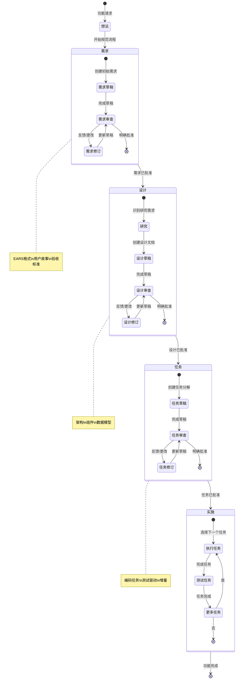

## 阶段转换决策树

此决策树帮助确定何时在阶段之间移动以及何时迭代：

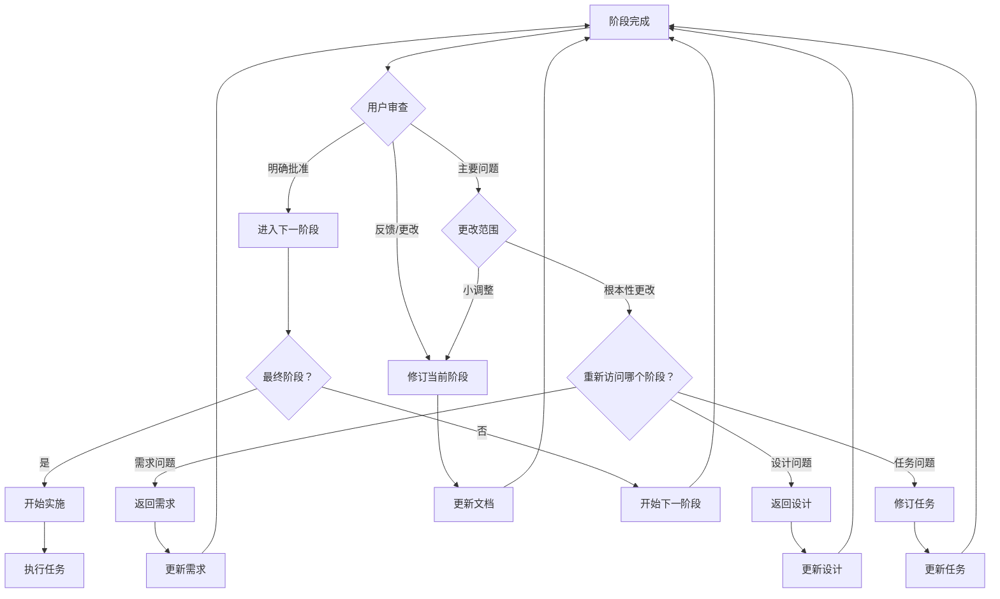

## 需求阶段流程

需求收集阶段的详细工作流程：

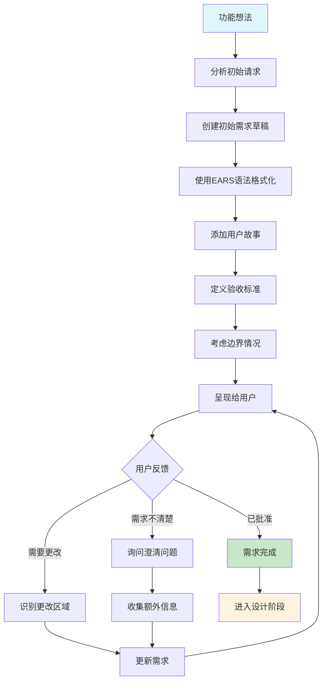

## 设计阶段流程

设计阶段的详细工作流程：

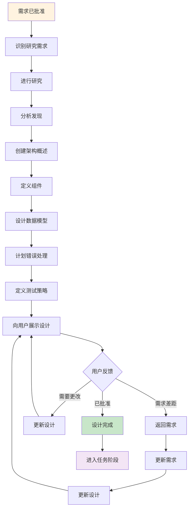

## 任务阶段流程

将设计分解为实施任务的详细工作流程：

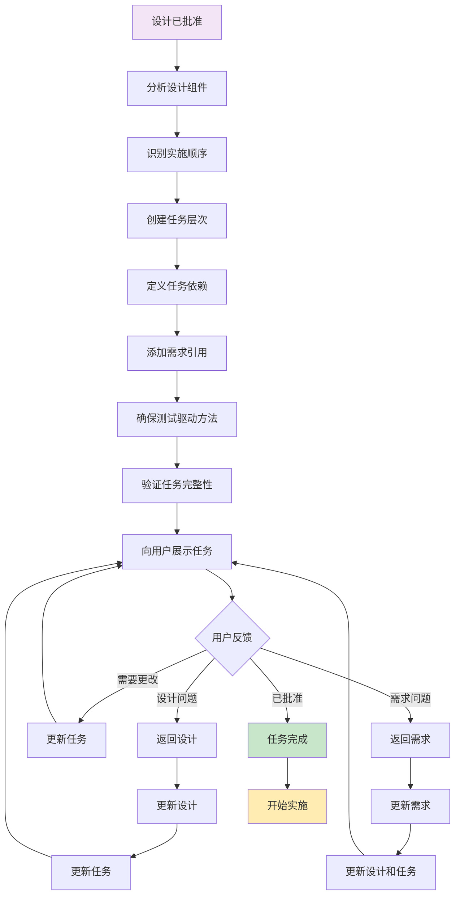

## 实施执行流程

从实施计划执行单个任务的工作流程：

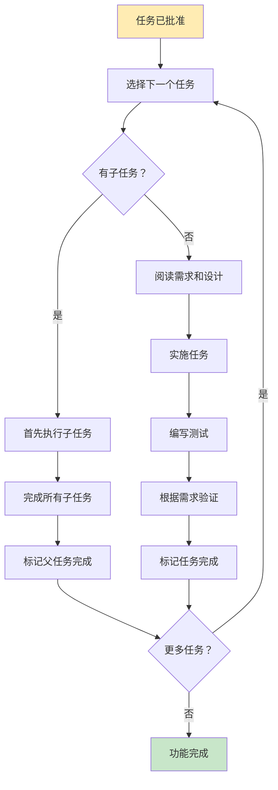

## 反馈循环模式

处理反馈和迭代的常见模式：

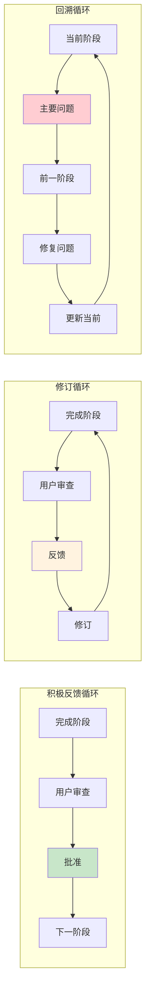

## 入口点和上下文

用户进入规范工作流的不同方式：

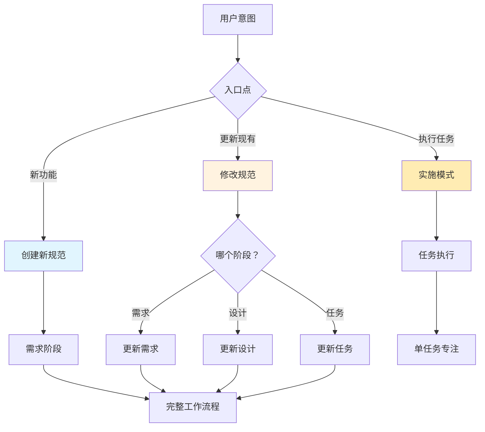

## 质量门和验证点

整个流程中的关键验证检查点：

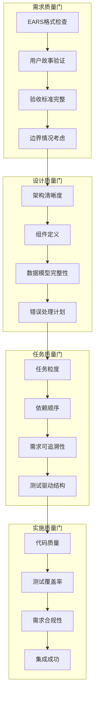

## 常见工作流程场景

### 场景1：顺畅线性进展
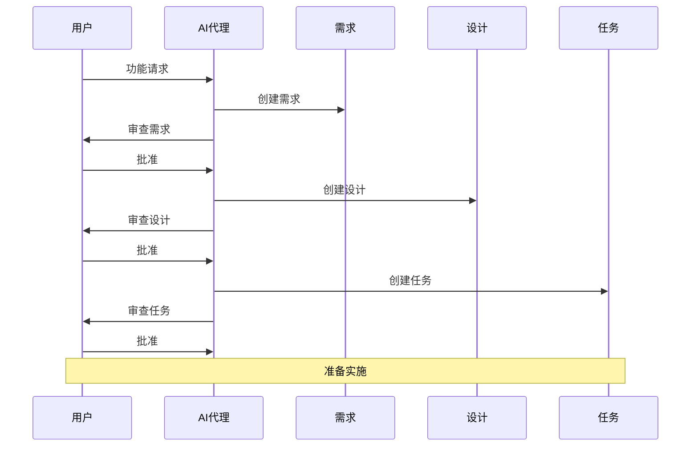

### 场景2：迭代完善
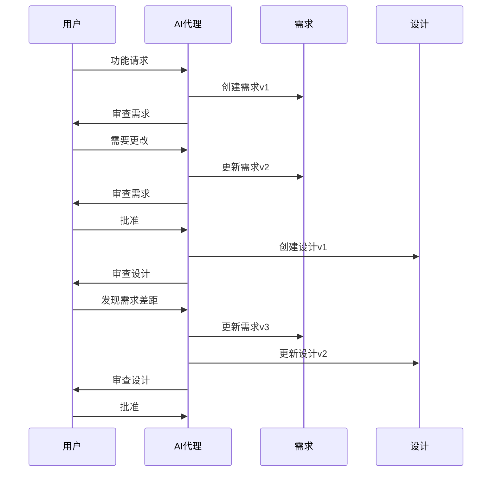

### 场景3：实施反馈
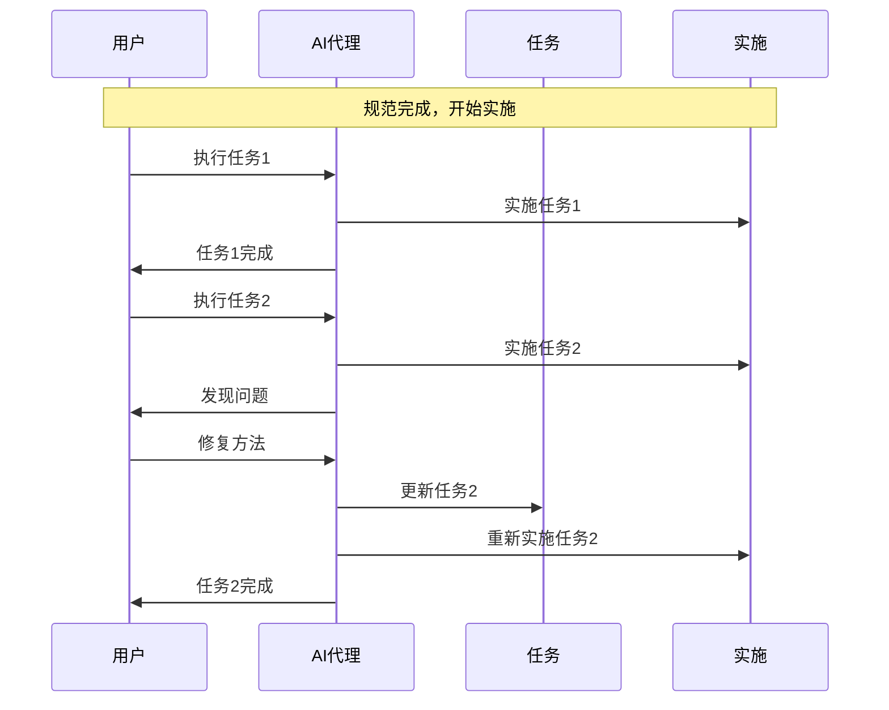

这些可视化辅助工具为理解和导航规范驱动开发流程提供了全面指导，既支持学习方法论的新手，也为寻求快速参考资料的经验丰富的实践者提供帮助。
