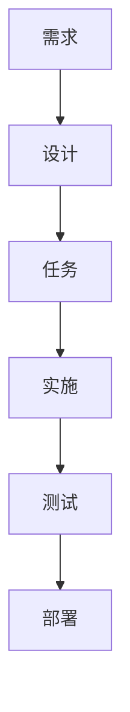

# 工具和集成指南

本指南为支持规范驱动开发流程的工具、平台和集成提供建议。

## 文档工具

### Markdown编辑器和平台

#### GitHub/GitLab
**最适合**：版本控制文档、团队协作

**功能特性**：
- 原生Markdown渲染
- 文档的拉取请求审查
- 问题跟踪集成
- Wiki功能
- Mermaid图表支持

**集成建议**：
- 将规范存储在`.kiro/specs/`目录结构中
- 使用分支保护进行规范审查
- 将问题链接到具体需求
- 使用GitHub Pages发布文档

#### Notion
**最适合**：富格式、数据库集成、团队知识库

**功能特性**：
- 富文本编辑和Markdown导出
- 需求跟踪的数据库视图
- 一致格式的模板系统
- 实时协作
- 与项目管理工具集成

**集成建议**：
- 为每个规范阶段创建模板页面
- 使用数据库跟踪需求状态
- 链接相关页面进行交叉引用
- 导出为Markdown进行版本控制

#### Obsidian
**最适合**：知识图谱、交叉引用、个人知识管理

**功能特性**：
- 文档间双向链接
- 需求关系的图形视图
- 扩展功能的插件生态系统
- 本地文件存储和同步选项
- 高级搜索和筛选

**集成建议**：
- 使用标签进行需求分类
- 创建一致结构的模板
- 利用图形视图进行依赖分析
- 使用日记跟踪规范开发进度

#### Confluence
**最适合**：企业文档、结构化内容管理

**功能特性**：
- 企业级协作
- 高级权限和工作流
- 模板系统和宏
- 与Atlassian套件集成
- 高级搜索和报告

**集成建议**：
- 为规范项目创建空间模板
- 使用页面模板确保格式一致
- 利用宏创建动态内容
- 与Jira集成进行需求跟踪

### 图表工具

#### Mermaid
**最适合**：基于代码的图表、版本控制集成

**支持的图表**：
- 流程图用于处理流程
- 序列图用于交互
- 类图用于数据模型
- 状态图用于系统行为
- 甘特图用于项目时间线

**使用示例**：


**集成建议**：
- 直接嵌入Markdown文档
- 在所有图表中使用一致样式
- 版本控制图表源代码
- 从图表生成文档

#### Lucidchart
**最适合**：复杂系统图表、协作设计

**功能特性**：
- 专业图表工具
- 实时协作
- 模板库
- 与文档平台集成
- 高级样式和格式

**集成建议**：
- 为常见模式创建图表模板
- 使用共享文件夹供团队访问
- 导出图表用于文档嵌入
- 将图表链接到具体需求

#### Draw.io（现在的diagrams.net）
**最适合**：免费图表、离线功能

**功能特性**：
- 免费开源
- 网页版和桌面版
- 与云存储集成
- 丰富的形状库
- 多种格式导出

**集成建议**：
- 将图表保存在项目仓库中
- 使用一致的命名约定
- 创建自定义形状库
- 导出为SVG进行可伸缩嵌入

## 项目管理和跟踪

### Linear
**最适合**：现代项目管理、以开发者为中心的工作流

**功能特性**：
- 清洁、快速的界面
- Git集成
- 自动化工作流
- 需求跟踪
- Sprint规划

**规范集成**：
- 从需求创建问题
- 将任务链接到具体验收标准
- 跟踪实施进度
- 生成规范完成报告

**设置建议**：
- 为规范阶段创建标签（需求、设计、任务）
- 使用自定义字段进行需求可追溯性
- 设置状态更新自动化
- 为不同利益相关者创建视图

### Jira
**最适合**：企业项目管理、复杂工作流

**功能特性**：
- 可定制工作流
- 高级报告
- 集成生态系统
- 需求管理
- 敏捷规划工具

**规范集成**：
- 为每个主要需求创建史诗
- 将史诗分解为用户故事
- 将故事链接到验收标准
- 通过自定义仪表板跟踪进度

**设置建议**：
- 为需求创建自定义问题类型
- 使用组件按功能区域组织
- 设置EARS跟踪的自定义字段
- 为规范进度创建仪表板

### GitHub Issues/Projects
**最适合**：代码集成的项目管理、开源项目

**功能特性**：
- 原生Git集成
- 项目看板和自动化
- 问题模板
- 里程碑跟踪
- 拉取请求集成

**规范集成**：
- 为需求创建问题模板
- 使用项目看板进行规范阶段
- 将拉取请求链接到需求
- 通过里程碑跟踪完成情况

**设置建议**：
- 为需求类型创建标签
- 使用问题模板确保一致性
- 设置项目自动化规则
- 将问题链接到具体代码更改

### Trello
**最适合**：简单看板、可视化项目管理

**功能特性**：
- 可视化看板
- 基于卡片的组织
- 扩展功能的Power-ups
- 团队协作
- 移动应用

**规范集成**：
- 为每个规范阶段创建看板
- 使用卡片表示单个需求
- 为验收标准添加检查清单
- 通过工作流阶段移动卡片

**设置建议**：
- 为新规范创建看板模板
- 使用标签表示需求优先级
- 为里程碑跟踪添加截止日期
- 使用power-ups进行时间跟踪

## 需求管理工具

### Azure DevOps
**最适合**：企业需求管理、Microsoft生态系统

**功能特性**：
- 工作项跟踪
- 需求层次结构
- 可追溯性矩阵
- 测试用例管理
- 与开发工具集成

**规范集成**：
- 为需求创建工作项类型
- 构建需求层次结构
- 将需求链接到测试用例
- 生成可追溯性报告

### IBM DOORS
**最适合**：受监管行业、复杂需求可追溯性

**功能特性**：
- 正式需求管理
- 变更影响分析
- 基线管理
- 合规报告
- 与测试工具集成

**规范集成**：
- 从规范导入需求
- 维护需求基线
- 跟踪需求更改
- 生成合规报告

### Aha!
**最适合**：产品管理、路线图规划

**功能特性**：
- 产品路线图管理
- 功能优先级排序
- 利益相关者沟通
- 与开发工具集成
- 战略规划

**规范集成**：
- 从需求创建功能
- 基于业务价值排序
- 向利益相关者传达路线图
- 跟踪功能交付

## 测试和质量保证工具

### 测试管理

#### TestRail
**最适合**：全面测试管理、需求可追溯性

**功能特性**：
- 测试用例管理
- 测试执行跟踪
- 需求覆盖分析
- 报告和分析
- 与缺陷跟踪集成

**规范集成**：
- 从验收标准创建测试用例
- 跟踪需求覆盖
- 将测试结果链接到需求
- 生成覆盖报告

#### Zephyr
**最适合**：Jira集成、敏捷测试

**功能特性**：
- 原生Jira集成
- 测试用例创建和执行
- 实时报告
- 可追溯性矩阵
- 自动化集成

**规范集成**：
- 将测试用例链接到需求问题
- 在Jira中跟踪测试进度
- 生成需求覆盖报告
- 与CI/CD管道集成

### 自动化测试

#### Jest/Vitest
**最适合**：JavaScript/TypeScript单元测试

**集成建议**：
- 测试文件命名与需求匹配
- 使用describe块进行需求分组
- 在测试描述中包含需求ID
- 为需求生成覆盖报告

#### Cypress/Playwright
**最适合**：端到端测试、用户场景验证

**集成建议**：
- 从用户故事创建测试场景
- 使用数据属性进行需求可追溯性
- 生成带需求映射的测试报告
- 与CI/CD集成进行持续验证

#### Postman/Insomnia
**最适合**：API测试、集成验证

**集成建议**：
- 为API需求创建测试集合
- 使用环境变量处理不同测试场景
- 从测试生成API文档
- 与CI/CD集成进行自动化API测试

## 开发和代码质量工具

### 代码质量

#### SonarQube
**最适合**：代码质量分析、技术债务管理

**功能特性**：
- 静态代码分析
- 安全漏洞检测
- 代码覆盖率跟踪
- 技术债务评估
- 质量门强制执行

**规范集成**：
- 基于需求设置质量门
- 跟踪需求实施的代码覆盖率
- 监控技术债务引入
- 为利益相关者生成质量报告

#### ESLint/Prettier
**最适合**：代码格式和语法检查

**集成建议**：
- 基于项目标准配置规则
- 与CI/CD集成进行自动化检查
- 使用pre-commit钩子确保一致性
- 生成代码质量指标报告

### 版本控制

#### Git工作流
**最适合**：代码版本控制、协作

**规范集成策略**：
- **功能分支**：为每个需求创建分支
- **提交消息**：在提交中引用需求ID
- **拉取请求**：将PR链接到具体需求
- **标签**：用需求完成标记发布

**分支命名约定**：
- `feature/req-1.1-user-authentication`
- `bugfix/req-2.3-validation-error`
- `docs/req-update-api-spec`

## CI/CD和自动化工具

### 持续集成

#### GitHub Actions
**最适合**：GitHub集成的CI/CD、工作流自动化

**规范集成**：
- 在需求相关更改时触发构建
- 运行特定需求区域的测试
- 生成需求完成报告
- 基于需求状态自动化部署

**示例工作流**：
```yaml
name: 需求验证
on:
  pull_request:
    paths:
      - 'src/requirements/**'
jobs:
  validate:
    runs-on: ubuntu-latest
    steps:
      - uses: actions/checkout@v2
      - name: 运行需求测试
        run: npm test -- --grep "需求"
```

#### Jenkins
**最适合**：企业CI/CD、复杂管道

**规范集成**：
- 为需求验证创建管道
- 与测试工具集成
- 生成需求完成报告
- 基于质量门自动化部署

#### GitLab CI
**最适合**：GitLab集成的CI/CD、DevOps工作流

**规范集成**：
- 使用合并请求模板进行需求审查
- 为需求测试创建管道
- 生成覆盖报告
- 自动化需求状态更新

## 沟通和协作工具

### 团队沟通

#### Slack
**最适合**：实时团队沟通、集成中心

**规范集成**：
- 为规范讨论创建频道
- 使用机器人进行需求状态更新
- 与项目管理工具集成
- 分享规范进度和更新

**机器人集成**：
- GitHub/GitLab规范更改通知
- Jira/Linear需求进度更新
- 规范审查的日历提醒
- 需求查询的自定义机器人

#### Microsoft Teams
**最适合**：企业沟通、Microsoft生态系统

**规范集成**：
- 为规范开发创建团队
- 为不同规范阶段使用频道
- 与Azure DevOps集成
- 分享文档并协作规范

#### Discord
**最适合**：社区驱动项目、非正式沟通

**规范集成**：
- 为规范讨论创建频道
- 使用机器人进行自动化更新
- 分享进度并获得反馈
- 协调开发活动

### 审查和批准

#### ReviewBoard
**最适合**：代码和文档审查工作流

**功能特性**：
- 文档审查工作流
- 评论和批准跟踪
- 与版本控制集成
- 审查分析和报告

**规范集成**：
- 审查需求文档
- 跟踪批准状态
- 管理审查反馈
- 生成审查报告

#### Collaborator
**最适合**：企业代码和文档审查

**功能特性**：
- 正式审查流程
- 合规报告
- 与开发工具集成
- 高级分析

**规范集成**：
- 正式规范审查流程
- 合规跟踪
- 审查指标和报告
- 与质量门集成

## 监控和分析工具

### 应用监控

#### DataDog
**最适合**：应用性能监控、可观测性

**规范集成**：
- 监控需求特定指标
- 为功能性能创建仪表板
- 为需求违反设置警报
- 跟踪用户行为进行需求验证

#### New Relic
**最适合**：应用性能监控、用户体验

**规范集成**：
- 监控功能性能指标
- 跟踪新功能的用户交互
- 为性能需求设置警报
- 生成需求合规报告

### 分析和报告

#### Google Analytics
**最适合**：用户行为跟踪、功能使用分析

**规范集成**：
- 跟踪新功能使用情况
- 测量需求成功指标
- 分析用户行为模式
- 生成功能采用报告

#### Mixpanel
**最适合**：产品分析、事件跟踪

**规范集成**：
- 跟踪需求特定事件
- 测量功能成功指标
- 分析用户参与度
- 生成需求性能报告

## 工具集成策略

### 工作流集成

#### 单一数据源
- 选择一个主要工具进行需求存储
- 使用API在工具间同步数据
- 保持跨平台的一致性
- 建立明确的数据所有权

#### API集成
- 使用webhooks进行实时更新
- 在需要时实施自定义集成
- 利用现有集成平台
- 监控集成健康和性能

#### 自动化工作流
- 跨工具自动化状态更新
- 为需求更改创建触发器
- 自动生成报告
- 通知利益相关者重要更新

### 最佳实践

#### 工具选择标准
- **团队规模**：选择与团队规模匹配的工具
- **预算**：考虑组织的成本效益
- **集成**：确保工具良好协作
- **学习曲线**：考虑采用时间和培训需求
- **支持**：评估供应商支持和社区

#### 实施策略
1. **从小开始**：从核心工具开始逐步扩展
2. **试点项目**：首先与小团队测试工具
3. **培训**：为团队成员提供充分培训
4. **反馈**：收集反馈并迭代工具使用
5. **优化**：持续优化工作流和集成

#### 维护和更新
- 定期审查工具有效性
- 保持集成更新和安全
- 监控工具使用和采用
- 规划工具迁移和升级
- 维护工具使用文档

---

## 工具比较矩阵

| 类别 | 工具 | 最适合 | 成本 | 学习曲线 | 集成性 |
|----------|------|----------|------|----------------|-------------|
| 文档 | GitHub | 版本控制 | 免费/付费 | 低 | 优秀 |
| 文档 | Notion | 富格式 | 付费 | 中等 | 良好 |
| 文档 | Confluence | 企业 | 付费 | 中等 | 优秀 |
| 项目管理 | Linear | 现代团队 | 付费 | 低 | 良好 |
| 项目管理 | Jira | 企业 | 付费 | 高 | 优秀 |
| 项目管理 | GitHub Projects | 代码集成 | 免费/付费 | 低 | 优秀 |
| 图表 | Mermaid | 基于代码 | 免费 | 中等 | 优秀 |
| 图表 | Lucidchart | 专业 | 付费 | 低 | 良好 |
| 测试 | Jest | 单元测试 | 免费 | 中等 | 良好 |
| 测试 | Cypress | E2E测试 | 免费/付费 | 中等 | 良好 |
| CI/CD | GitHub Actions | GitHub集成 | 免费/付费 | 中等 | 优秀 |
| CI/CD | Jenkins | 企业 | 免费 | 高 | 良好 |

## 推荐工具栈

### 初创/小团队栈
**预算**：低到中等
**团队规模**：2-10名开发者
**复杂度**：低到中等

**核心工具**：
- **文档**：GitHub + Markdown
- **项目管理**：Linear或GitHub Projects
- **图表**：Mermaid（嵌入文档）
- **测试**：Jest + Cypress
- **CI/CD**：GitHub Actions
- **沟通**：Slack

**总成本**：每月50-200美元
**设置时间**：1-2天
**学习曲线**：低

**优点**：
- 集成生态系统
- 成本和复杂度低
- 设置和采用快速
- 适合以代码为中心的团队

**缺点**：
- 高级功能有限
- 可能无法扩展到大团队
- 企业集成较少

### 企业栈
**预算**：高
**团队规模**：50+名开发者
**复杂度**：高

**核心工具**：
- **文档**：Confluence + SharePoint
- **项目管理**：Jira + Azure DevOps
- **需求**：IBM DOORS或Azure DevOps
- **图表**：Lucidchart + Visio
- **测试**：TestRail + Selenium Grid
- **CI/CD**：Jenkins + Azure Pipelines
- **沟通**：Microsoft Teams

**总成本**：每月500-2000美元
**设置时间**：2-4周
**学习曲线**：高

**优点**：
- 企业级功能
- 高级报告和分析
- 合规和审计支持
- 广泛集成选项

**缺点**：
- 成本和复杂度高
- 设置和培训时间长
- 对小项目可能过度

### 混合/现代栈
**预算**：中等
**团队规模**：10-50名开发者
**复杂度**：中等

**核心工具**：
- **文档**：Notion + GitHub
- **项目管理**：Linear + Jira（复杂项目）
- **图表**：Mermaid + Lucidchart
- **测试**：Jest + Playwright + TestRail
- **CI/CD**：GitHub Actions + Jenkins
- **沟通**：Slack + Microsoft Teams

**总成本**：每月200-800美元
**设置时间**：1周
**学习曲线**：中等

**优点**：
- 功能和成本平衡
- 灵活适应
- 良好集成选项
- 随团队增长扩展

**缺点**：
- 需要更多工具管理
- 潜在集成复杂性
- 可能需要自定义解决方案

## 工具选择框架

### 评估标准

#### 功能需求
1. **核心功能**：工具是否提供必要功能？
2. **集成**：与现有工具集成如何？
3. **可扩展性**：能否随团队和项目增长？
4. **定制化**：能否适应特定需求？
5. **报告**：是否提供必要分析和报告？

#### 非功能需求
1. **性能**：工具是否快速响应？
2. **可靠性**：是否稳定且在需要时可用？
3. **安全性**：是否满足安全要求？
4. **可用性**：是否易于学习和使用？
5. **支持**：提供什么级别的支持？

#### 业务考虑
1. **成本**：包括许可、培训、维护的总拥有成本
2. **投资回报率**：预期投资回报和生产力提升
3. **风险**：供应商稳定性、锁定担忧、迁移复杂性
4. **合规**：监管和政策合规要求
5. **时间线**：实施时间线和资源要求

### 决策矩阵模板

| 工具 | 核心功能 | 集成 | 可扩展性 | 成本 | 可用性 | 总分 |
|------|---------------|-------------|-------------|------|-----------|-------------|
| 选项1 | 8/10 | 7/10 | 9/10 | 6/10 | 8/10 | 38/50 |
| 选项2 | 9/10 | 8/10 | 7/10 | 8/10 | 7/10 | 39/50 |
| 选项3 | 7/10 | 9/10 | 8/10 | 7/10 | 9/10 | 40/50 |

### 实施路线图

#### 第1阶段：基础（第1-2周）
- 设置核心文档平台
- 配置基础项目管理
- 建立团队沟通渠道
- 创建初始模板和工作流

#### 第2阶段：增强（第3-4周）
- 添加图表和可视化工具
- 实施测试和质量保证工具
- 设置基础自动化和CI/CD
- 培训团队使用新工具和流程

#### 第3阶段：优化（第5-8周）
- 集成高级功能和定制
- 实施全面监控和报告
- 优化工作流和自动化
- 收集反馈并迭代流程

#### 第4阶段：扩展（持续）
- 根据需要添加其他工具
- 为更大团队扩展流程
- 实施高级集成
- 持续改进和优化

## 集成模式和最佳实践

### API集成模式

#### 基于Webhook的集成
```javascript
// 示例：GitHub webhook更新项目管理工具
app.post('/webhook/github', (req, res) => {
  const { action, pull_request } = req.body;

  if (action === 'opened' && pull_request.title.includes('[REQ-')) {
    // 从PR标题提取需求ID
    const reqId = pull_request.title.match(/\[REQ-(\d+\.\d+)\]/)[1];

    // 更新项目管理工具
    await updateTaskStatus(reqId, 'in_progress');
  }

  res.status(200).send('OK');
});
```

#### 基于轮询的集成
```javascript
// 示例：在工具间同步需求状态
async function syncRequirementStatus() {
  const requirements = await getRequirementsFromSource();

  for (const req of requirements) {
    const currentStatus = await getStatusFromProjectTool(req.id);
    const expectedStatus = await getStatusFromRequirementTool(req.id);

    if (currentStatus !== expectedStatus) {
      await updateStatus(req.id, expectedStatus);
    }
  }
}

// 每15分钟运行一次
setInterval(syncRequirementStatus, 15 * 60 * 1000);
```

#### 事件驱动集成
```javascript
// 示例：工具集成的事件总线
class SpecEventBus {
  constructor() {
    this.subscribers = new Map();
  }

  subscribe(event, handler) {
    if (!this.subscribers.has(event)) {
      this.subscribers.set(event, []);
    }
    this.subscribers.get(event).push(handler);
  }

  publish(event, data) {
    const handlers = this.subscribers.get(event) || [];
    handlers.forEach(handler => handler(data));
  }
}

// 使用
const eventBus = new SpecEventBus();

eventBus.subscribe('requirement.updated', async (data) => {
  await updateProjectManagementTool(data);
  await notifyStakeholders(data);
  await updateDocumentation(data);
});
```

### 数据同步策略

#### 主从模式
- 一个工具作为数据的主要源
- 其他工具从主工具同步
- 实施和维护简单
- 如果主工具失败存在数据丢失风险

#### 多主模式
- 多个工具可以更新相同数据
- 需要冲突解决机制
- 更复杂但更具弹性
- 更适合分布式团队

#### 事件溯源模式
- 所有更改都存储为事件
- 工具重放事件构建当前状态
- 优秀的审计跟踪和调试
- 实施更复杂

### 自动化工作流

#### 需求生命周期自动化
```yaml
# 需求更新的GitHub Actions工作流
name: 需求生命周期
on:
  push:
    paths:
      - '.kiro/specs/*/requirements.md'

jobs:
  validate-requirements:
    runs-on: ubuntu-latest
    steps:
      - uses: actions/checkout@v2
      - name: 验证EARS格式
        run: |
          python scripts/validate_ears.py
      - name: 更新项目管理
        run: |
          python scripts/sync_requirements.py
      - name: 通知利益相关者
        run: |
          python scripts/notify_stakeholders.py
```

#### 测试集成自动化
```yaml
# 基于需求的自动化测试
name: 需求测试
on:
  pull_request:
    types: [opened, synchronize]

jobs:
  test-requirements:
    runs-on: ubuntu-latest
    steps:
      - uses: actions/checkout@v2
      - name: 提取需求ID
        id: extract
        run: |
          echo "::set-output name=req_ids::$(grep -o 'REQ-[0-9]\+\.[0-9]\+' ${{ github.event.pull_request.body }})"
      - name: 运行需求特定测试
        run: |
          npm test -- --grep "${{ steps.extract.outputs.req_ids }}"
```

## 安全和合规考虑

### 数据保护
- **加密**：确保数据在传输和静态时加密
- **访问控制**：实施基于角色的访问控制
- **审计日志**：维护全面审计日志
- **数据保留**：实施适当数据保留政策

### 合规要求
- **GDPR**：确保工具符合数据保护法规
- **SOX**：维护财务合规的审计跟踪
- **HIPAA**：如适用保护健康信息
- **行业标准**：遵循相关行业标准

### 安全最佳实践
- **身份验证**：使用强身份验证机制
- **授权**：实施最小权限访问
- **网络安全**：保护网络通信安全
- **漏洞管理**：定期安全评估

## 成本优化策略

### 许可证管理
- **基于用户的许可**：优化用户分配
- **基于功能的许可**：只为需要的功能付费
- **批量折扣**：为大团队协商更好费率
- **年度vs月度**：考虑年度承诺节省成本

### 资源优化
- **云vs本地**：评估总拥有成本
- **共享资源**：在多个项目间共享工具
- **自动化**：通过自动化减少人工工作
- **培训**：投资培训提高效率

### 投资回报率测量
- **生产力指标**：测量开发速度改进
- **质量指标**：跟踪缺陷减少和质量改进
- **时间节省**：量化通过自动化节省的时间
- **成本避免**：计算通过更好流程避免的成本

---

[← 标准](standards.md) | [检查清单 →](../templates/checklists.md) | [返回资源](README.md)
