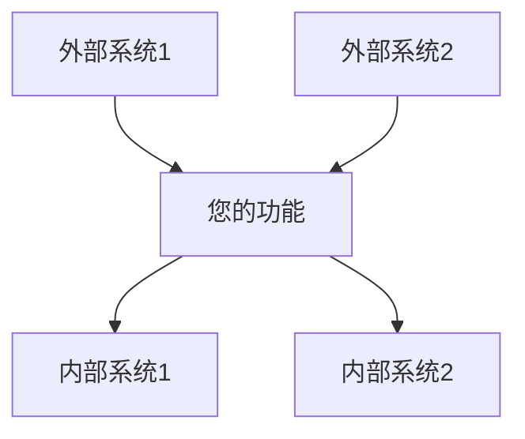
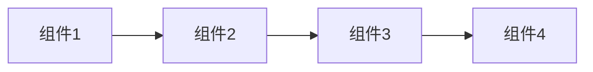
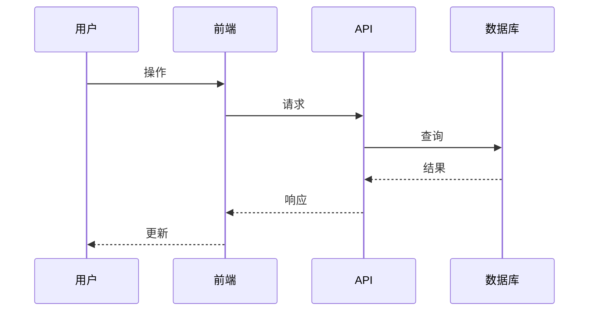

# 设计模板

<!-- 导航元数据 -->
<!-- 模板：设计 | 等级：模板 | 前提条件：requirements-template.md -->
<!-- 相关：process/design-phase.md, ai-reasoning/decision-frameworks.md, examples/complex-system-spec.md -->

**📍 您在这里：** [主指南](../../README.md) → [模板](README.md) → **设计模板**

## 快速导航
- **📚 学习流程：** [设计阶段指南](../process/design-phase.md) - 如何使用此模板
- **📖 查看示例：** [复杂系统设计](../examples/complex-system-spec.md#design-document) - 模板实际应用
- **🧠 决策帮助：** [决策框架](../ai-reasoning/decision-frameworks.md) - 如何做出设计选择
- **➡️ 下一个模板：** [任务模板](tasks-template.md) - 设计完成后

---

使用此模板创建将需求转换为技术规范的全面设计文档。

## 文档信息

- **功能名称**：[您的功能名称]
- **版本**：1.0
- **日期**：[当前日期]
- **作者**：[您的姓名]
- **审查者**：[列出技术审查者]
- **相关文档**：[链接到需求文档]

## 概述

[提供设计方法的高层次摘要。解释此设计如何解决需求并融入整体系统架构。保持此部分简洁但全面。]

### 设计目标
- [主要目标1]
- [主要目标2]
- [主要目标3]

### 关键设计决策
- [决策1及理由]
- [决策2及理由]
- [决策3及理由]

## 架构

### 系统上下文
[描述此功能如何融入更广泛的系统。包括外部依赖和集成点。]



### 高层次架构
[描述整体架构方法和主要组件。]



### 技术栈
| 层次 | 技术 | 理由 |
|------|------|------|
| 前端 | [技术] | [选择原因] |
| 后端 | [技术] | [选择原因] |
| 数据库 | [技术] | [选择原因] |
| 基础设施 | [技术] | [选择原因] |

## 组件和接口

### 组件1：[组件名称]

**目的**：[此组件的功能]

**职责**：
- [职责1]
- [职责2]
- [职责3]

**接口**：
- **输入**：[接收什么]
- **输出**：[产生什么]
- **依赖**：[依赖什么]

**实施说明**：
- [关键实施细节1]
- [关键实施细节2]

### 组件2：[组件名称]

**目的**：[此组件的功能]

**职责**：
- [职责1]
- [职责2]

**接口**：
- **输入**：[接收什么]
- **输出**：[产生什么]
- **依赖**：[依赖什么]

**实施说明**：
- [关键实施细节1]
- [关键实施细节2]

### 组件3：[组件名称]

**目的**：[此组件的功能]

**职责**：
- [职责1]
- [职责2]

**接口**：
- **输入**：[接收什么]
- **输出**：[产生什么]
- **依赖**：[依赖什么]

**实施说明**：
- [关键实施细节1]
- [关键实施细节2]

## 数据模型

### 实体1：[实体名称]

```typescript
interface EntityName {
  id: string;
  property1: string;
  property2: number;
  property3: boolean;
  createdAt: Date;
  updatedAt: Date;
}
```

**验证规则**：
- [验证规则1]
- [验证规则2]

**关系**：
- [与其他实体的关系]

### 实体2：[实体名称]

```typescript
interface EntityName {
  id: string;
  property1: string;
  property2: EntityName[];
  status: 'active' | 'inactive' | 'pending';
}
```

**验证规则**：
- [验证规则1]
- [验证规则2]

**关系**：
- [与其他实体的关系]

### 数据流



## API设计

### 端点1：[端点名称]

**方法**：`POST`
**路径**：`/api/v1/[resource]`

**请求**：
```json
{
  "property1": "string",
  "property2": "number",
  "property3": "boolean"
}
```

**响应**：
```json
{
  "id": "string",
  "property1": "string",
  "property2": "number",
  "createdAt": "ISO日期字符串"
}
```

**错误响应**：
- `400 Bad Request`：[何时发生]
- `401 Unauthorized`：[何时发生]
- `404 Not Found`：[何时发生]

### 端点2：[端点名称]

**方法**：`GET`
**路径**：`/api/v1/[resource]/{id}`

**参数**：
- `id`（路径）：[描述]
- `include`（查询，可选）：[描述]

**响应**：
```json
{
  "id": "string",
  "property1": "string",
  "property2": "number"
}
```

## 安全考虑

### 身份验证
- [身份验证方法和实施]
- [令牌管理方法]

### 授权
- [授权模型和规则]
- [权限检查策略]

### 数据保护
- [数据加密方法]
- [PII处理程序]
- [数据保留策略]

### 输入验证
- [验证策略]
- [净化程序]
- [速率限制方法]

## 错误处理

### 错误类别
| 类别 | HTTP状态 | 描述 | 用户行为 |
|------|----------|------|----------|
| 验证 | 400 | 无效输入数据 | 修复输入并重试 |
| 身份验证 | 401 | 无效凭据 | 重新验证 |
| 授权 | 403 | 权限不足 | 联系管理员 |
| 未找到 | 404 | 资源不存在 | 检查资源标识符 |
| 服务器错误 | 500 | 内部系统错误 | 稍后重试或联系支持 |

### 错误响应格式
```json
{
  "error": {
    "code": "ERROR_CODE",
    "message": "人类可读的错误消息",
    "details": {
      "field": "特定字段错误"
    },
    "timestamp": "ISO日期字符串",
    "requestId": "唯一请求标识"
  }
}
```

### 日志策略
- **错误日志**：[错误记录什么]
- **审计日志**：[审计记录什么]
- **性能日志**：[监控记录什么]

## 性能考虑

### 预期负载
- **并发用户**：[数量]
- **每秒请求数**：[数量]
- **数据量**：[大小/增长率]

### 性能要求
- **响应时间**：[目标响应时间]
- **吞吐量**：[目标吞吐量]
- **可用性**：[正常运行时间要求]

### 优化策略
- [缓存策略]
- [数据库优化方法]
- [CDN使用]
- [负载均衡方法]

### 监控和指标
- [关键性能指标]
- [监控工具和仪表板]
- [警报阈值]

## 测试策略

### 单元测试
- **覆盖率目标**：[百分比]
- **测试框架**：[框架名称]
- **关键测试区域**：[要测试的关键功能]

### 集成测试
- **API测试**：[方法和工具]
- **数据库测试**：[方法和工具]
- **外部服务测试**：[模拟策略]

### 端到端测试
- **用户场景**：[要测试的关键用户旅程]
- **测试工具**：[E2E测试框架]
- **测试环境**：[环境设置]

### 性能测试
- **负载测试**：[方法和工具]
- **压力测试**：[要测试的限制]
- **监控**：[要跟踪的性能指标]

## 部署和操作

### 部署策略
- [部署方法（蓝绿、滚动等）]
- [环境进展]
- [回滚程序]

### 配置管理
- [配置方法]
- [环境特定设置]
- [密钥管理]

### 监控和警报
- [健康检查]
- [要监控的关键指标]
- [警报条件和升级]

### 维护程序
- [定期维护任务]
- [备份和恢复程序]
- [更新和补丁策略]

## 迁移和兼容性

### 数据迁移
- [迁移策略（如适用）]
- [数据转换要求]
- [回滚程序]

### 向后兼容性
- [API版本策略]
- [破坏性变更程序]
- [弃用时间线]

### 集成影响
- [对现有系统的影响]
- [依赖系统所需的更改]
- [变更沟通计划]

---

## 设计审查检查清单

使用此检查清单验证您的设计文档：

### 架构
- [ ] 高层次架构清晰描述
- [ ] 组件职责定义明确
- [ ] 组件间接口已指定
- [ ] 技术选择有依据

### 需求对齐
- [ ] 设计解决所有功能需求
- [ ] 考虑了非功能需求
- [ ] 此设计可以满足成功标准
- [ ] 约束和假设已解决

### 技术质量
- [ ] 设计遵循既定模式和原则
- [ ] 安全考虑已解决
- [ ] 考虑了性能要求
- [ ] 错误处理全面

### 实施就绪
- [ ] 设计为实施提供足够细节
- [ ] 数据模型完整且已验证
- [ ] API规范详细
- [ ] 测试策略全面

### 可维护性
- [ ] 设计支持未来可扩展性
- [ ] 组件松散耦合
- [ ] 配置外部化
- [ ] 包含监控和可观测性

---

## 设计模式参考

### 需要考虑的常见模式

**创建型模式**：
- 工厂模式：当您需要创建对象而不指定确切类时
- 建造者模式：当逐步构建复杂对象时
- 单例模式：当您需要类的唯一实例时

**结构型模式**：
- 适配器模式：当集成不兼容接口时
- 装饰器模式：当在不改变结构的情况下添加行为时
- 外观模式：当简化复杂子系统接口时

**行为型模式**：
- 观察者模式：当对象需要被通知状态变化时
- 策略模式：当您需要在算法间切换时
- 命令模式：当您需要用操作参数化对象时

**架构模式**：
- MVC/MVP/MVVM：用于分离表示层和业务逻辑
- 仓储模式：用于抽象数据访问逻辑
- 工作单元模式：用于维护多个操作间的一致性

---

[← 需求模板](requirements-template.md) | [任务模板 →](tasks-template.md)
